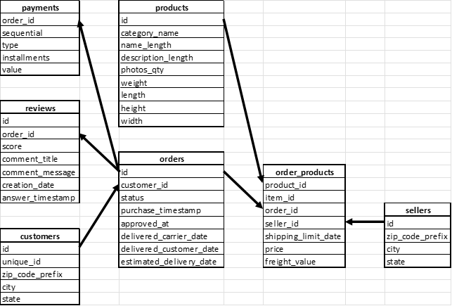

# data-analytics
PET-проект представляет собой извлечение при помощи PostgreSQL, обработку при помощи pandas и визуализацию при помощи matplotlib реальных данных.

Датасет: [https://www.kaggle.com/datasets/olistbr/brazilian-ecommerce)](https://www.kaggle.com/datasets/olistbr/brazilian-ecommerce)

Предварительно из датасета исключена таблица olist_geolocation_dataset, поскольку в ней нет уникальных данных, а также изменены названия столбцов всех таблиц на более короткие. Нормализация данных не проводилась. Таким образом, схема базы данных для дальнейшей работы выглядит так:

Все CSV-файлы загружены в качестве таблиц в PostgreSQL-БД, таблицам добавлены первичные и внешние ключи, столбцам указаны нужные типы данных. Удалены строки, у которых в поле для первичного ключа было значение NULL.

## Задание № 1
С использованием PostgreSQL написать SQL-запросы для извлечения из БД следующих данных:
1.	3 продавца с наибольшей и наименьшей средними оценками в каждом штате каждый год
2.	Ежемесячное количество заказов в каждом штате
3.	Ежемесячное прибавление суммарного веса каждой категории за 2017 год
4.	Ежегодная суммарная стоимость заказов в каждом штате
5.	5 покупателей с наибольшей средней стоимостью заказа каждый месяц
6.	Ежемесячное прибавление суммарной стоимости заказов в каждом штате за 2017 год
7.	5 самых больших доставленных объёмов в каждом штате каждый год
8.	Ежемесячное изменение средней оценки каждого продавца
9.	Продавец с наибольшей средней оценкой в каждом штате каждый год

Готовые SQL-запросы находятся в файле **consts.py**.

## Задание № 2
Для 2-го и 3-го пунктов задания № 1 написать код, которые визуализирует результаты SQL-запроса. Для визуализации используется matplotlib, для предобработки данных используется pandas.

Готовый код для пункта 2 находится в файле **ex2.py**, для пункта 3 — в файле **ex3.py**.

Пример визуализации данных в пункте 2 (нужный год и месяц вводит пользователь). Доля топ-5 штатов по количеству заказов в общем количестве заказов в указанном месяце (октябрь 2016 года):

Пример визуализации данных в пункте 3 (список нужных категорий вводит пользователь). Ежемесячное изменение суммарного веса товаров указанных категорий в 2017 году:

