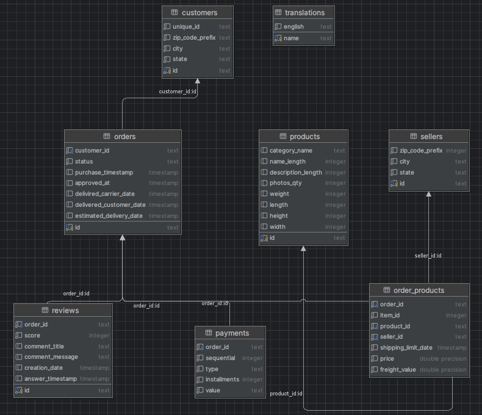
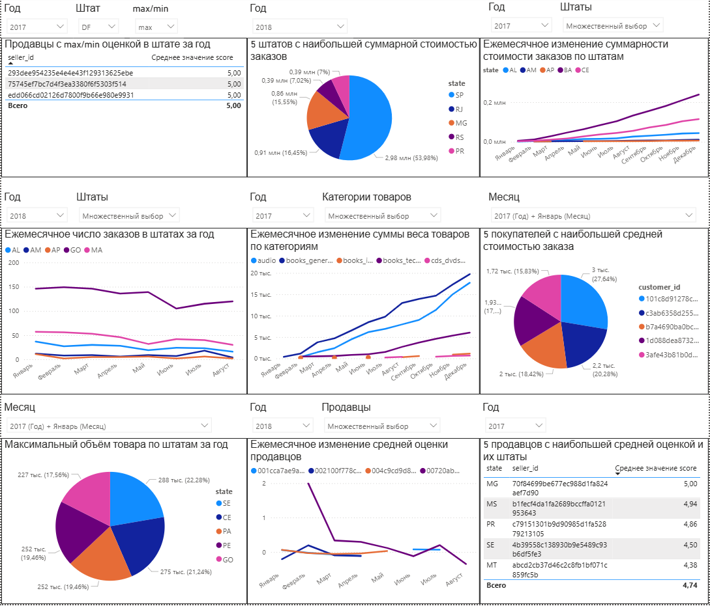
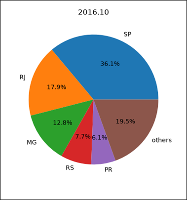
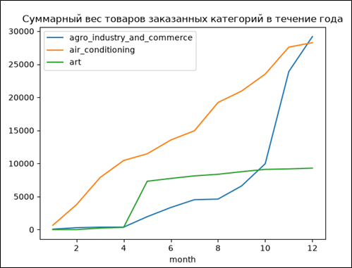

# Извлечение, обработка и визуализация реальных данных

Исходный датасет состоит из 9 таблиц, в которых содержится информация о куплепродаже товаров: [https://www.kaggle.com/datasets/olistbr/brazilian-ecommerce](https://www.kaggle.com/datasets/olistbr/brazilian-ecommerce)

Предварительно датасета я исключил таблицу olist_geolocation_dataset, поскольку в ней нет уникальных данных, а также поменял названия столбцов всех таблиц на более короткие. Нормализацию данных не проводил. Таким образом, схема базы данных для дальнейшей работы выглядит так:

## Часть 1

С использованием PostgreSQL написал SELECT-запросы для извлечения из БД следующих данных (готовые SQL-запросы в ****):
1.	3 продавца с наибольшей и наименьшей средними оценками в каждом штате каждый год
2.	Ежемесячное количество заказов в каждом штате
3.	Ежемесячное прибавление суммарного веса каждой категории за 2017 год
4.	Ежегодная суммарная стоимость заказов в каждом штате
5.	5 покупателей с наибольшей средней стоимостью заказа каждый месяц
6.	Ежемесячное прибавление суммарной стоимости заказов в каждом штате за 2017 год
7.	5 самых больших доставленных объёмов в каждом штате каждый год
8.	Ежемесячное изменение средней оценки каждого продавца
9.	Продавец с наибольшей средней оценкой в каждом штате каждый год

## Часть 2

### 1. Power BI

По извлечённым данным построил дашборд из 9 диаграмм (находится в файле dashboard.pbix):

### 2. Python

Для пунктов 2 и 3 написал программу, которая визуализирует результаты выполнения SQL-запросов. Для предобработки данных использовал pandas, для визуализации использовал matplotlib.

Готовый код для пункта 2 в ****, для пункта 3 - в ****.

Пример визуализации данных в пунктах 2 и 3:

 

### 3. MS Excel

Аналогично извлёк, обработал и визуализировал данные из PostgreSQL в MS Excel по схеме: **PostgreSQL -> Power Query -> Сводная таблица -> Сводная диаграмма**

Результат в ****.
